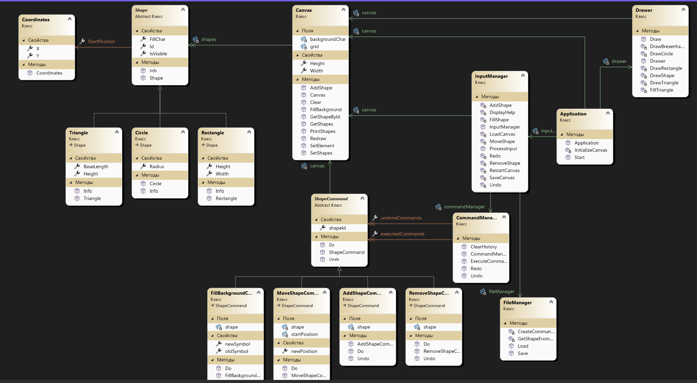

# Лабораторная работа №1

## 1. Описание проекта
Данный проект представляет собой консольное приложение, которое позволяет пользователю рисовать фигуры, перемещать их, удалять, изменять фон, а также сохранять и загружать холст. Дополнительно реализована возможность отмены и повтора действий.

## 2. Автор
Выполнил Суровцев А.И., группа 353505

## 3. UML-диаграмма

## 4. Функциональные требования

### 4.1 Настройка холста
- **Описание:** Пользователь может задать начальные размеры холста а также заливку канвы. Ширина в диапазоне от 5 до 100, высота от 5 до 55 включительно.

### 4.2 Рисование фигур

- **Описание:** Пользователь может рисовать базовые фигуры (прямоугольник, круг и треугольник) на холсте, указывая стартовую позицию и символ, которым будет нарисована фигура.
- **Команда:** `/add [фигура] [x] [y] [символ] [параметры фигуры]`
- **Параметры:**
  - `[фигура]` — тип фигуры (например, "rectangle", "circle", "triangle").
  - `[x] [y]` — координаты стартовой точки фигуры.
  - `[символ]` — символ, используемый для рисования фигуры (например, "#", "*").
  - `[параметры фигуры]` — параметры, специфичные для выбранной фигуры (например, для прямоугольника: ширина и высота, для круга: радиус, для треугольника: основание и высота).
- **Пример:** 
  - `/add rectangle 2 3 # 4 6` — рисует прямоугольник в точке (2, 3) с символом `#`, шириной 4 и высотой 6.

### 4.3 Удаление фигур

- **Описание:** Пользователь может удалить фигуру по её уникальному ID.
- **Команда:** `/remove [id фигуры]`
- **Параметры:**
  - `[id фигуры]` — уникальный идентификатор фигуры.
- **Пример:** 
  - `/remove 1` — удаляет фигуру с ID 1.

### 4.4 Перемещение фигур

- **Описание:** Пользователь может перемещать фигуры по холсту, изменяя их позицию с помощью дельты по осям X и Y.
- **Команда:** `/move [id фигуры] [delta_x] [delta_y]`
- **Параметры:**
  - `[id фигуры]` — уникальный идентификатор фигуры.
  - `[delta_x]` — изменение позиции по оси X.
  - `[delta_y]` — изменение позиции по оси Y.
- **Пример:**
  - `/move 1 2 3` — перемещает фигуру с ID 1 на 2 шага вправо и на 3 шага вниз.

### 4.5 Изменение заливки фигуры

- **Описание:** Пользователь может изменить заливку фигуры, что определяет символ, который будет использован для заполнения фигуры.
- **Команда:** `/fill [id фигуры] [символ]`
- **Параметры:**
  - `[id фигуры]` — уникальный идентификатор фигуры.
  - `[символ]` — символ, который будет использоваться для заливки фигуры.
- **Пример:** 
  - `/fill 1 @` — изменяет символ заливки фигуры с ID 1 на `@`.

### 4.6 Отмена действия

- **Описание:** Пользователь может отменить последнее действие (например, создание, удаление, перемещение или изменение фигуры).
- **Команда:** `/undo`
- **Пример:** 
  - `/undo` — отменяет последнее выполненное действие.

### 4.7 Повтор действия

- **Описание:** Пользователь может повторить последнее отменённое действие.
- **Команда:** `/redo`
- **Пример:** 
  - `/redo` — повторяет последнее отменённое действие.

### 4.8 Сохранение состояния холста

- **Описание:** Пользователь может сохранить текущее состояние холста в файл для последующего использования.
- **Команда:** `/save [путь_к_файлу]`
- **Параметры:**
  - `[путь_к_файлу]` — путь, по которому будет сохранено состояние холста.
- **Пример:** 
  - `/save canvas.txt` — сохраняет текущий холст в файл `canvas.txt`.

### 4.9 Загрузка состояния холста

- **Описание:** Пользователь может загрузить сохранённое состояние холста из файла.
- **Команда:** `/load [путь_к_файлу]`
- **Параметры:**
  - `[путь_к_файлу]` — путь к файлу, из которого будет загружен холст.
- **Пример:** 
  - `/load canvas.txt` — загружает состояние холста из файла `canvas.txt`.

### 4.10 Просмотр информации о фигурах

- **Описание:** Пользователь может вывести информацию о текущих фигурах на холсте.
- **Команда:** `/ps`
- **Пример:** 
  - `/ps` — выводит все текущие фигуры и их детали.

### 4.11 Очистка холста

- **Описание:** Пользователь может очистить весь холст, удалив все фигуры.
- **Команда:** `/clear`
- **Пример:** 
  - `/clear` — удаляет все фигуры с холста.

### 4.12 Выход из программы

- **Описание:** Пользователь может выйти из программы.
- **Команда:** `/q`
- **Пример:** 
  - `/q` — завершает работу программы.
  
### Список команд

- `/q` - Выйти из программы
- `/clear` - Очистить холст
- `/help` - Показать список доступных команд
- `/help [команда]` - Показать справку по конкретной команде
- `/ps` - Показать информацию о всех фигурах
- `/add [фигура] [x] [y] [символ] [параметры фигуры]` - Добавить фигуру на холст
- `/remove [id фигуры]` - Удалить фигуру с холста
- `/move [id фигуры] [delta_x] [delta_y]` - Переместить фигуру на холсте
- `/fill [id фигуры] [символ]` - Изменить символ заливки фигуры
- `/undo` - Отменить последнее действие
- `/redo` - Повторить последнее отменённое действие
- `/save [путь_к_файлу]` - Сохранить состояние холста в файл
- `/load [путь_к_файлу]` - Загрузить состояние холста из файла

---

Введите `/help [команда]`, чтобы узнать больше о каждой команде.