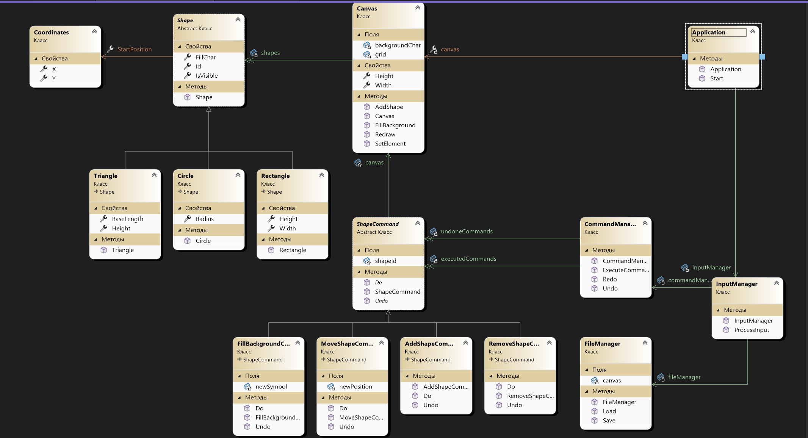

# Лабораторная работа №1

## 1. Описание проекта
Данный проект представляет собой консольное приложение, которое позволяет пользователю рисовать фигуры, перемещать их, удалять, изменять фон, а также сохранять и загружать холст. Дополнительно реализована возможность отмены и повтора действий.

## 2. Автор
Выполнил Суровцев А.И., группа 353505

## 3. UML-диаграмма

## 4. Функциональные требования

### 4.1 Настройка холста
- Пользователь может задать начальные размеры холста а также задний фон.

### 4.2 Рисование фигур
- Пользователь может рисовать базовые фигуры (прямоугольник, круг и треугольник). Для того чтобы нарисовать фигуру необходимо ввести команду "/add [название фигуры] [стартовая позиция] [символ] [параметры для конкретной фигуры]".
- Названия : rectangle, triangle, circle.
- Стартовая позиция это координата начальной точки по x и y.
- Символ - это то чем будет вырисована фигура на холсте.
- Параметры : Для прямоугольника стороны a и b. Для треугольника это высота и длина основания. Для окружности это радиус.
- Фигуры имеют свойства накладываться друг на друга.
- Различать между собой можно по индексам, которые им присваиваются при создании в порядке их создания.

### 4.3 Удаление фигур
- Пользователь может удалить любую нарисованную фигуру. Для того чтобы нарисовать фигуру необходимо ввести команду "/remove [id фигуры]".

### 4.4 Перемещение фигур
- Пользователь может перемещать фигуры по холсту. Для перемещения фигуры на delta_x и delta_y соответственно необходимо ввести команду "/move [id фигуры] [delta_x] [delta_y]".

### 4.5 Настройка фона
- Пользователь может изменять фоновый символ фигуры. "/fill [id фигуры] [символ]".

### 4.6 Сохранение и загрузка
- Пользователь может сохранять текущее состояние холста в файл и загружать его позже, при этом имея возможность продолжить работать со всеми фигурами. "/save [file_path]".
- Загрузить из файла "/load [file_path]"

### 4.7 Отмена и повтор действия
- "/undo". Отменяет результат последнего действия (перемещение, заполнение, удаление или создание фигуры). Можно выполнить после другой отмены или их последовательности, тогда соответствующее действие будет отменено. Если никаких действий не предпринималось, то эта команда ничего не сделает. Может быть выполнено после загрузки холста из файла.
- "/redo". Отменяет последнюю команду отмены, если между ними не было выполнено никаких действий, в противном случае ничего не происходит. Может быть выполнено после загрузки холста из файла.

### 4.8 Выход из программы
- Для выхода необходимо ввести "/q" и нажать Enter.