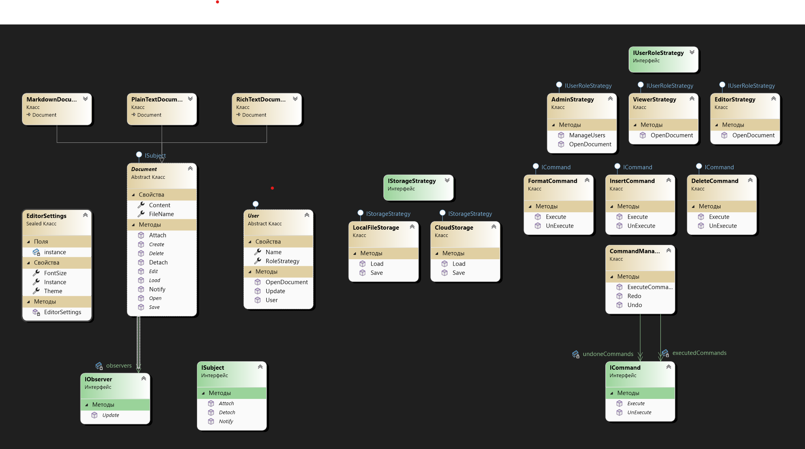

# Лабораторная работа №2

## 1. Описание проекта
Консольный редактор документов позволяет пользователям легко создавать, редактировать и форматировать текстовые документы. Поддерживает различные типы документов (PlainText, Markdown, RichText) и форматы сохранения (TXT, JSON, XML). Пользователи могут управлять документами, применять текстовое форматирование, а также использовать функции отмены и повтора изменений. Редактор предлагает различные роли пользователей с соответствующими разрешениями и возможность настройки глобальных параметров, таких как темы и размер шрифта.

## 2. Автор
Выполнил Суровцев А.И., группа 353505

## 3. UML-диаграмма
