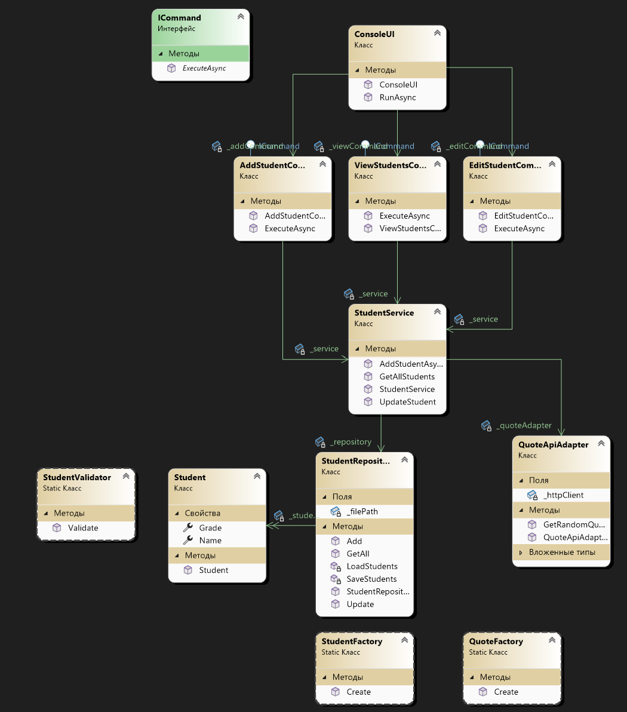

# Лабораторная работа №3

## 1. Описание проекта
Консольная система управления записями студентов позволяет добавлять, редактировать и просматривать данные учащихся (имя и оценку) с валидацией ввода. После добавления студента система автоматически получает мотивационную цитату через API quotable.io и отображает ее пользователю. Данные хранятся в JSON-файле, архитектура разделена на слои (Presentation, Application, Domain, DataAccess), используются DTO для передачи данных и паттерны проектирования: Command для операций, Adapter для интеграции с API, Factory Method для создания объектов. Проект обеспечивает безопасную обработку ввода и устойчивость к ошибкам.

## 2. Автор
Выполнил Суровцев А.И., группа 353505

## 3. UML-диаграмма
